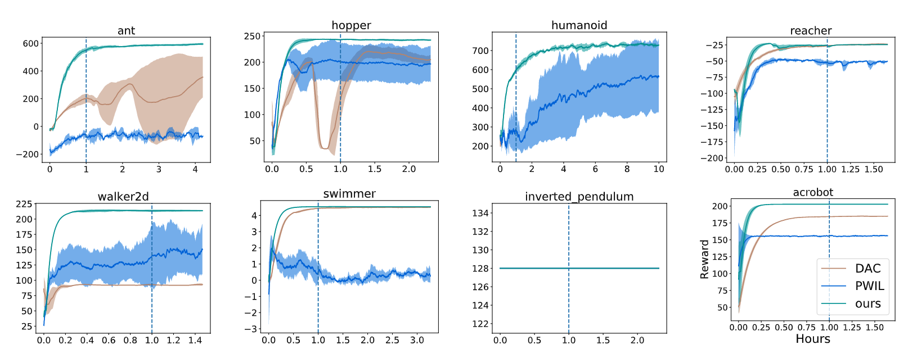
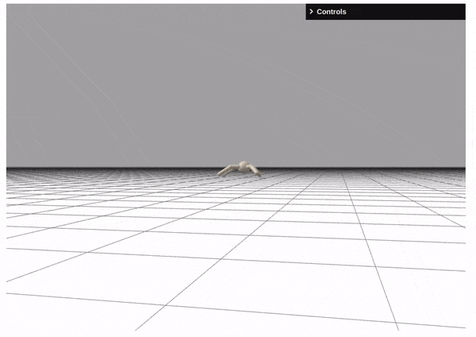
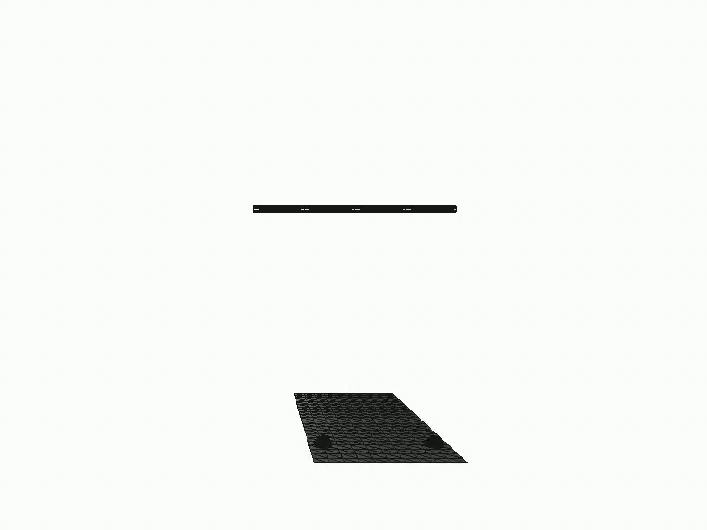
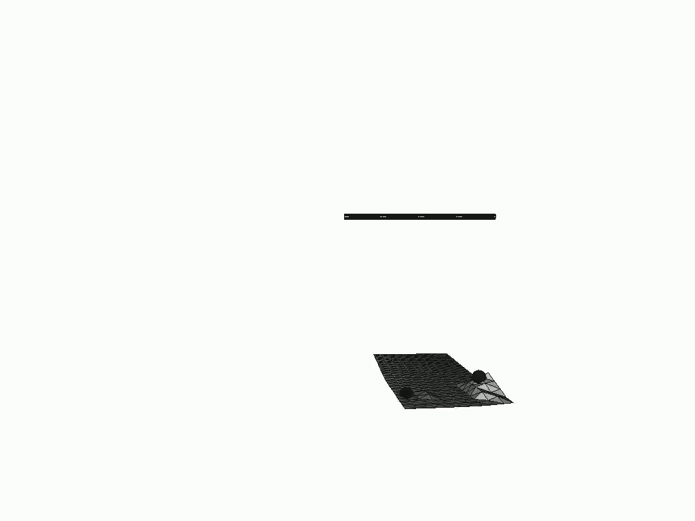

## Imitation Learning via Differentiable Physics 

Existing imitation learning (IL) methods such as inverse reinforcement learning (IRL) usually have a double-loop training process, alternating between learning a reward function and a policy and tend to suffer long training time and high variance. In this work, we identify the benefits of differentiable physics simulators and propose a new IL method, i.e., Imitation Learning via Differentiable Physics (ILD), which gets rid of the double-loop design and achieves significant improvements in final performance, convergence speed, and stability.

[[paper](https://arxiv.org/abs/2206.04873)] [[code](https://github.com/sail-sg/ILD)]

#### Brax MuJoCo Tasks

Our ILD agent learns using a single expert demonstration with much less variance and higher performance.

Expert Demo | Learned Policy 
:-: | :-:
 |  

#### Cloth Manipulation Task

We collect a single expert demonstration in a noise-free environment. Despite the presence of severe control noise in the test environment, our method completes the task and recovers the expert behavior.

Expert Demo (Noise-free) | Learned Policy (Heavy Noise in Control) 
:-: | :-:
 |  

#### Installation

~~~
conda create -n ILD python==3.8
conda activate ILD

pip install --upgrade pip
pip install --upgrade "jax[cuda]" -f https://storage.googleapis.com/jax-releases/jax_cuda_releases.html
pip install brax
pip install streamlit
pip install tensorflow
pip install open3d
~~~

#### Start training
~~~
cd policy/brax_task
CUDA_VISIBLE_DEVICES=0 python train_on_policy.py --env="ant" --seed=1

cd policy/cloth_task
CUDA_VISIBLE_DEVICES=0 python train_on_policy.py --seed=1
~~~
